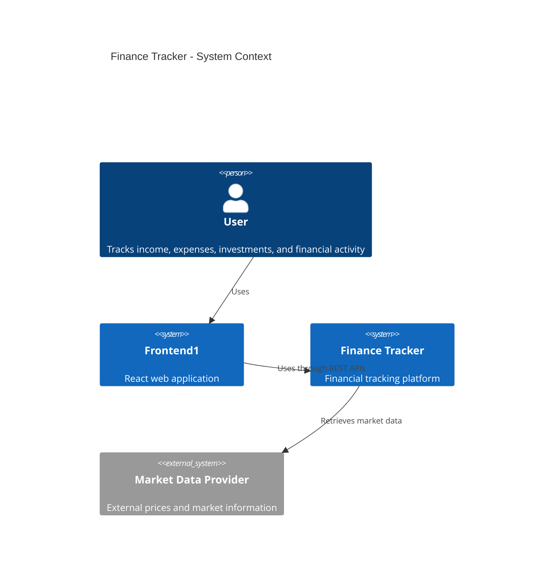
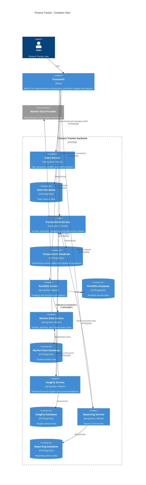
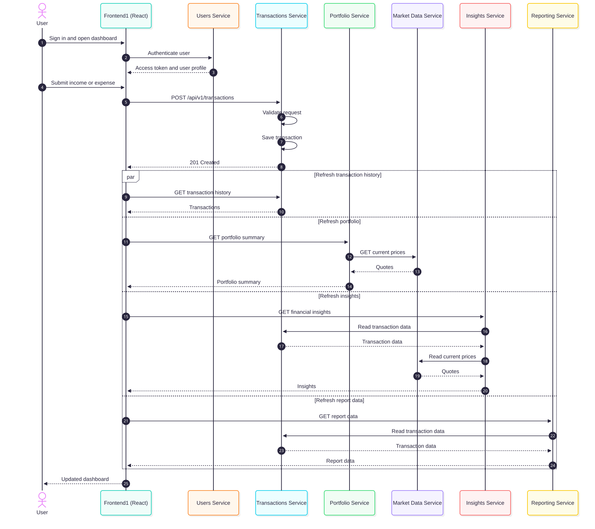
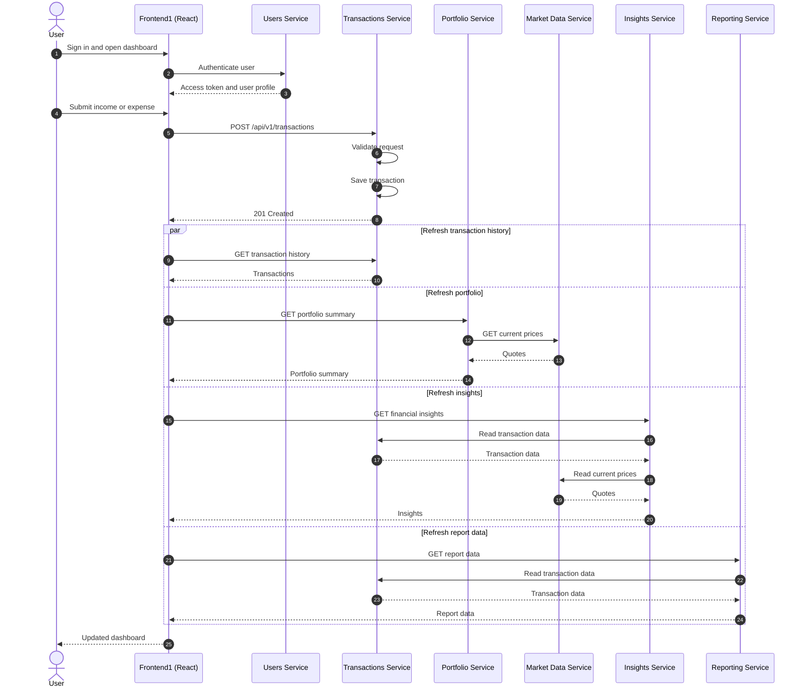

# Finance Tracker architecture diagrams

These diagrams describe the target architecture for Frontend1 and all six backend microservices. Frontend1 is the React application in [`frontend/`](../frontend/). Each backend service owns its data and exposes an API; services do not share databases.

## C4 context diagram

## C4 container diagram

## Sequence diagram: record a transaction and refresh the dashboard

This is the target request flow. The frontend calls the services directly; an API gateway can be introduced later if the team needs one public backend entry point.

### Boundary notes

- Each service reads and writes only its own database.
- Cross-service data is requested through APIs; no service imports another service's Java classes.
- The diagram shows the intended system-wide design. Authentication, portfolio, insights, and reporting flows are planned integration points while their services are still being implemented.
