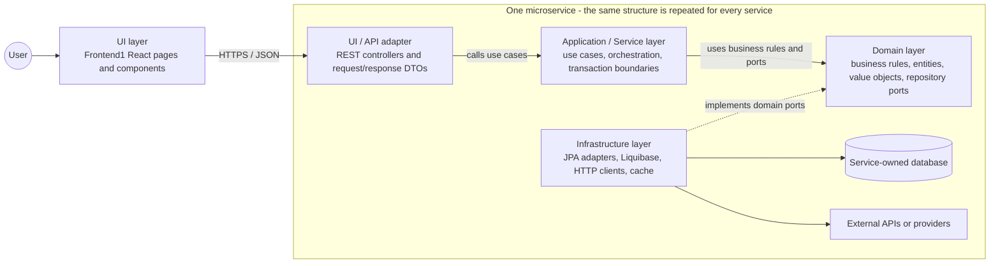

# Clean Architecture

This diagram shows the target responsibilities for each Finance Tracker microservice. Current package names and dependencies vary by service.





## Layer responsibilities

### UI layer

The UI layer is the outside entry point. It includes Frontend1 React pages/components and each service's REST controllers and DTOs. It handles HTTP concerns such as routes, JSON, status codes, and validation messages. It should not contain business rules or database queries.

### Application / Service layer

The application layer contains use cases such as `CreateTransaction` and `ListTransactions`. It coordinates the steps required by a use case, starts transaction boundaries, and calls domain objects and interfaces. It does not know whether data comes from JPA, PostgreSQL, H2, or an HTTP client.

### Domain layer

The domain layer contains the business meaning of the service: entities, value objects, enums, rules, and ports/interfaces. It should be plain Java and independent of Spring, JPA, Liquibase, HTTP, and databases.

For Transactions, the business concepts are `Transaction`, `TransactionType`, and `TransactionCategory`. A strict Clean Architecture implementation would define a persistence interface here.

### Infrastructure layer

Infrastructure supplies the technical implementations required by the application. It contains JPA entities and repository adapters, Liquibase migrations, HTTP clients, cache implementations, and configuration. It implements interfaces defined by the domain/application layers.

## Dependency rule

Dependencies point inward:

```text
UI / API  →  Application / Service  →  Domain
Infrastructure  →  Domain/Application interfaces
```

The domain must not import an outer layer. A service must not import another microservice's Java classes or database tables; cross-service communication uses APIs or events.

Transactions currently uses `rest`, `service`, `entity`, `repository`, `mapper`, `dto`, and `exception` packages. Its `Transaction` entity uses JPA, and its service calls a Spring Data repository directly, so it is a conventional layered implementation of these responsibilities rather than a strict application of the dependency rule above.
